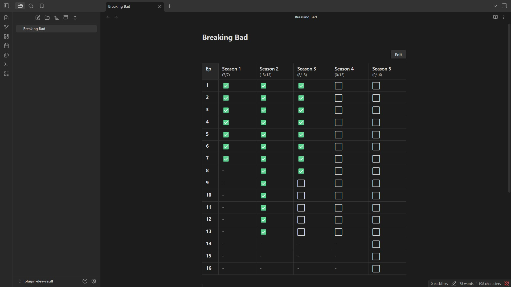
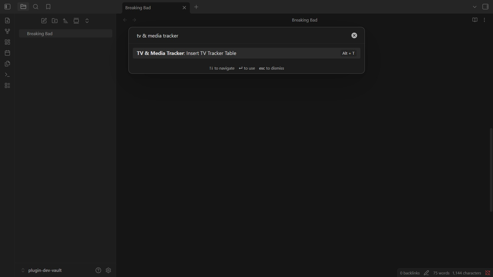
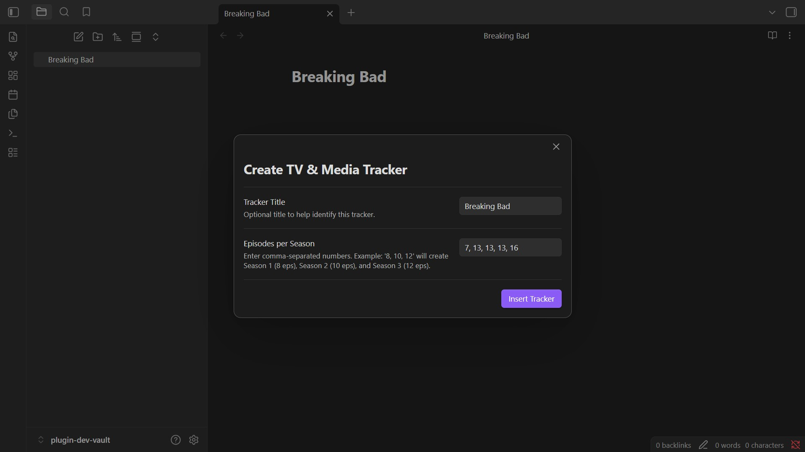
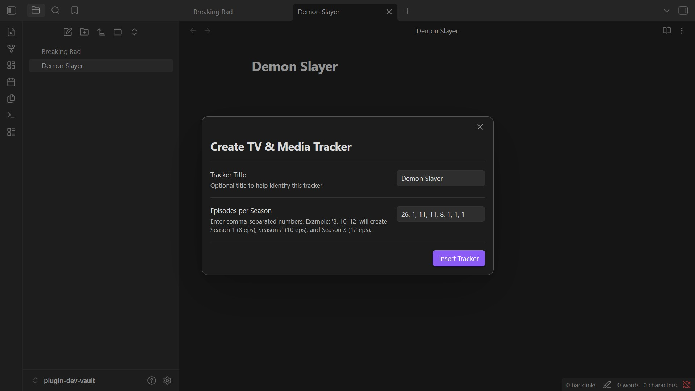
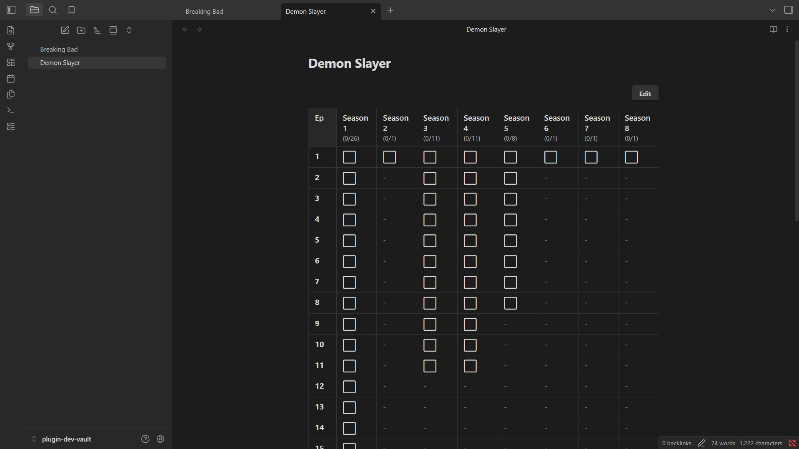
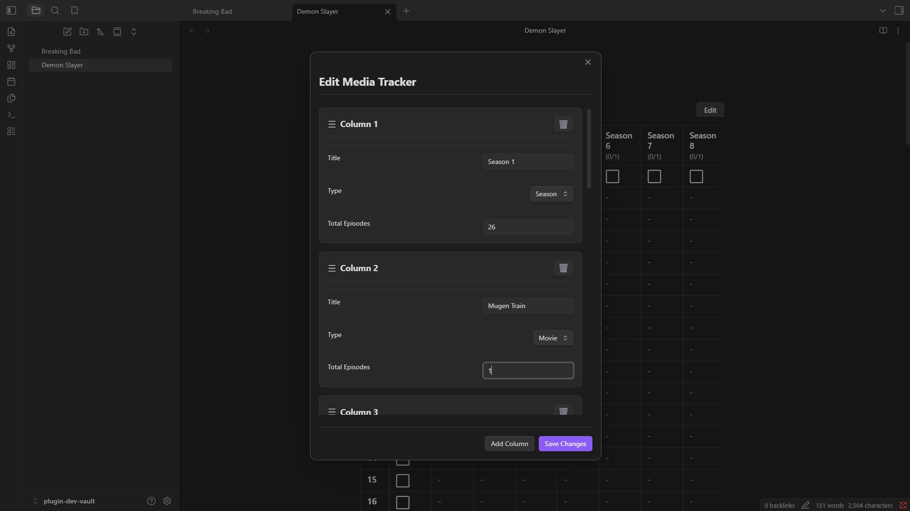
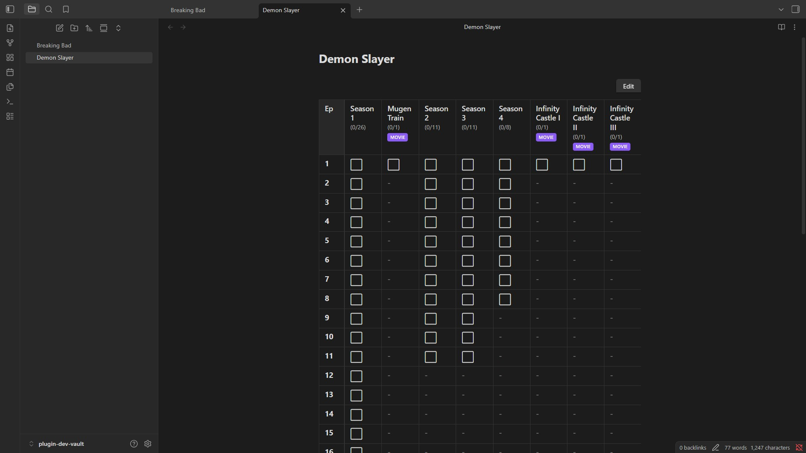

# Obsidian TV and Media Tracker

Create beautiful, interactive grid trackers for TV series, anime, and movies directly inside Obsidian.

Gone are the days of manually editing Markdown tables or fiddling with complex Dataview queries. This plugin provides a highly polished, interactive user interface to track your media consumption seamlessly without ever needing to touch the underlying code.

If you find this plugin helpful, please consider ⭐ starring this repository! It helps others discover the project.

## Features

* **Interactive Grids:** Click checkboxes directly in Reading or Live Preview mode to mark episodes as watched or skipped. Changes are saved and synced automatically.
* **Three-State Tracking:** Seamlessly toggle between Unseen, Seen, and Skipped/Filler states.
* **Mixed Media Support:** Effortlessly track standard seasons alongside single-episode movies and specials in a unified, chronological view.
* **Visual Editor:** A powerful drag-and-drop interface to add seasons, rename columns, and reorder groups visually.
* **Smart Interface:** Sticky episode columns ensure you never lose your place when scrolling horizontally through massive series. 
* **Bulk Actions:** Long-press any episode to instantly mark it and all preceding episodes as watched.
* **Fully Customizable:** Change your default tracker checkmarks and symbols directly from the Obsidian settings menu.

## Workflow & Usage

### 1. Trigger the Command
Open the Command Palette and search `Insert TV Tracker Table` or use your custom hotkey `ALT+D` to initialize a new tracker directly at your cursor.

### 2. Configure the Tracker
Use the intuitive wizard to instantly set up your seasons and episode counts. No JSON required.

### 3. Edit on the Fly
Made a mistake or starting a new season? Use the built-in visual editor to rename columns, change media types, or reorder seasons using drag-and-drop mechanics.

## Installation

**Community Plugins (Recommended)**
*(Pending approval in the official Obsidian directory)*
1. Go to **Settings > Community Plugins** in Obsidian.
2. Turn off Safe Mode.
3. Click **Browse** and search for "TV and Media Tracker".
4. Install and enable the plugin.

**Manual Installation**
1. Download the latest `main.js`, `styles.css`, and `manifest.json` from the Releases page.
2. Place them in a folder named `tv-media-tracker` inside your vault's `.obsidian/plugins/` directory.
3. Reload Obsidian and enable the plugin.

## Documentation

* **[User Guide](docs/user-guide.md):** Learn how to use the visual editor, bulk actions, and advanced JSON configurations.
* **[Developer Guide](docs/developer-guide.md):** Learn how to build the plugin locally and contribute to the project.

## License

This project is licensed under the MIT License. See the LICENSE file for details.

## Author

Made with love by [010101-sans](https://010101-sans.is-a.dev)
